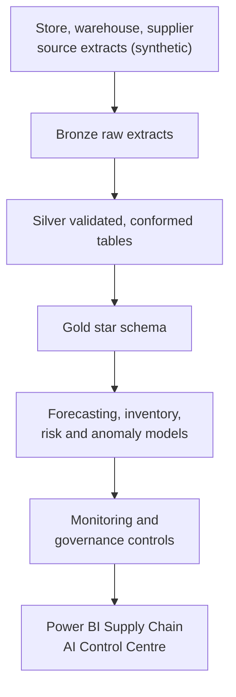
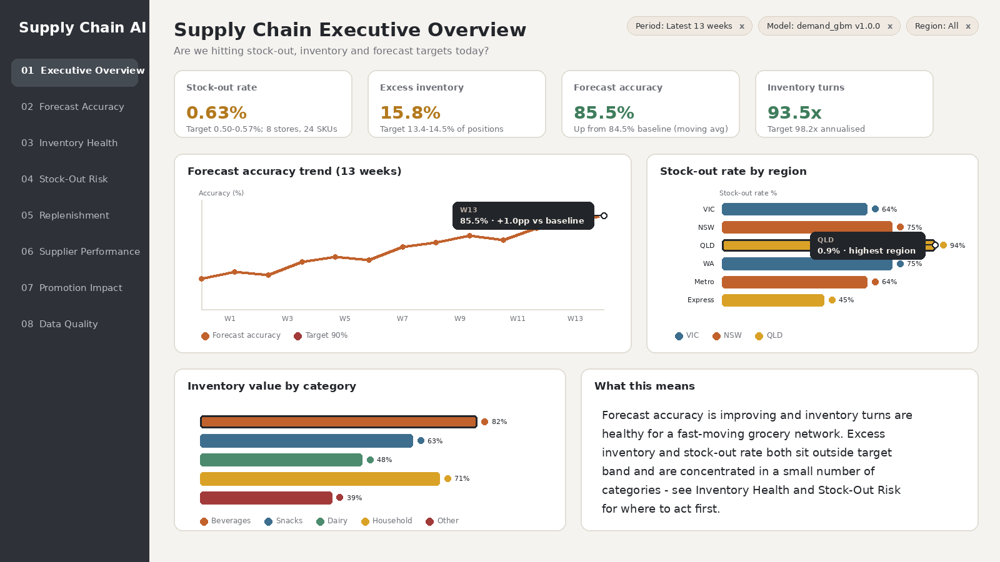

# Supply Chain Demand and Inventory Intelligence

An end-to-end demand forecasting and inventory intelligence platform for a regional retail supply chain. It turns store, warehouse, supplier and purchase-order data into daily forecasts, safety-stock and reorder-point recommendations, supplier risk scores, inventory anomaly alerts and promotion uplift evidence - with the governance controls a supply chain leadership team would expect before trusting the automation.

## Business case

Demand planning today runs on spreadsheets and static trailing averages that do not account for promotions, seasonality, weather, regional differences or supplier lead-time variability. The target operating outcomes are a 10-20% reduction in stock-outs, an 8-15% reduction in excess inventory, a 10% improvement in forecast accuracy, a 5% improvement in inventory turnover, and a 20% reduction in manual planning effort. Baselines are computed directly from the pipeline's holdout evaluation and business-KPI computation (not assumed), and reported in `artifacts/run_summary.json` on every run. See [business case](docs/business_case.md).

## Architecture



Local execution uses DuckDB; the bronze/silver/gold SQL, medallion layers and pipeline stages are designed to map directly onto Microsoft Fabric Lakehouse, Warehouse, Data Factory and Power BI.

## Quick start

```bash
python -m venv .venv
source .venv/bin/activate
pip install -r requirements.txt
python -m supply_chain.pipeline --scale dev --seed 42
python powerbi/Templates/render_mockups.py
pytest
```

The pipeline generates realistic synthetic source extracts (with injected data-quality defects), builds a DuckDB warehouse via real bronze/silver/gold SQL, trains and evaluates the forecasting/inventory/risk models, runs the governance and monitoring controls, and exports the Power BI-ready datasets and model artifacts. No real retailer, supplier or customer data is included. `--scale full` scales the same pipeline to a mid-size regional retailer footprint (see [architecture](docs/architecture.md) for sizing notes); `--scale dev` (the default) keeps a full run under two minutes for fast iteration.

## Repository map

| Area | Purpose |
|---|---|
| `supply_chain/` | Executable package: synthetic data generation, forecasting, inventory optimisation, risk, anomaly detection, monitoring, governance and pipeline orchestration |
| `python/` | Fabric-notebook-equivalent entrypoints (ingestion, transformation, features, models, monitoring, governance, utils) |
| `sql/` and `dbt/` | Bronze, silver, gold and analytics SQL, and an equivalent dbt project |
| `governance/` | Data catalogue, lineage, data-quality rules, privacy assessment, access control, risk register, model card |
| `powerbi/` | Semantic model, DAX measures, dashboard specification, theme, reproducible screenshot renderer and sample exports |
| `docs/` | Business case, architecture, data dictionary, metrics catalogue, operating model, executive presentation, portfolio summary |
| `tests/` | Automated tests for synthetic data, metrics, forecasting, inventory, risk and governance |

## Models and outcomes

A gradient-boosted demand model (`sklearn.ensemble.HistGradientBoostingRegressor`) is champion against a 4-week moving-average baseline and a SKU-level Holt-Winters exponential-smoothing model (statsmodels; used in place of Prophet so the project installs cleanly with no external compiled sampler dependency). Hierarchical reconciliation compares bottom-up and top-down accuracy from store-SKU through category to network total. Safety stock and reorder points combine observed demand and lead-time variability; a gradient-boosted classifier flags purchase orders at risk of late delivery (reported honestly at an AUC in the 0.55-0.65 range, with a documented feature-enrichment roadmap rather than an inflated number); IsolationForest flags inventory anomalies; a difference-in-differences design estimates promotion uplift against a same-weekday baseline. See [model card](governance/model_card.md) and [metrics catalogue](docs/metrics_catalogue.md).

## Governance

Product and supplier master-data controls, an 11-rule data-quality engine (two rules are deliberately left failing in the sample run so the controls have something real to catch), forecast-version and override tracking, drift and model-performance monitoring, an access control matrix, a privacy assessment, and a risk register. See [governance](governance/).

## Power BI dashboard

Eight pages - Executive Overview, Demand Forecast Accuracy, Inventory Health, Stock-Out Risk, Replenishment Recommendations, Supplier Performance, Promotion Impact, and Data Quality and Model Monitoring - built to a consistent interaction contract: a colour-coded legend under every chart, labelled axes, a hover-tooltip callout anchored to one data point per chart, a cross-filter highlight on a selected mark, and a persistent, removable filter-chip row. The image below is a reproducible design preview of the Executive Overview page; it demonstrates the intended navigation, KPIs, legends, tooltips and cross-filter highlighting, and is not presented as a native PBIX export.



View all 8 pages in [`powerbi/Screenshots`](powerbi/Screenshots), annotated layouts in [`powerbi/Mockups`](powerbi/Mockups), the [dashboard specification](powerbi/dashboard_specification.md), [semantic model](powerbi/semantic_model.md), [DAX measures](powerbi/dax_measures.md), and the reproducible build script at [`powerbi/Templates/render_mockups.py`](powerbi/Templates/render_mockups.py).

## Presentation materials

[Executive presentation / 5-minute walkthrough script](docs/executive_presentation.md), [portfolio summary and resume bullets](docs/portfolio_summary.md), [operating model](docs/operating_model.md), [data dictionary](docs/data_dictionary.md).
