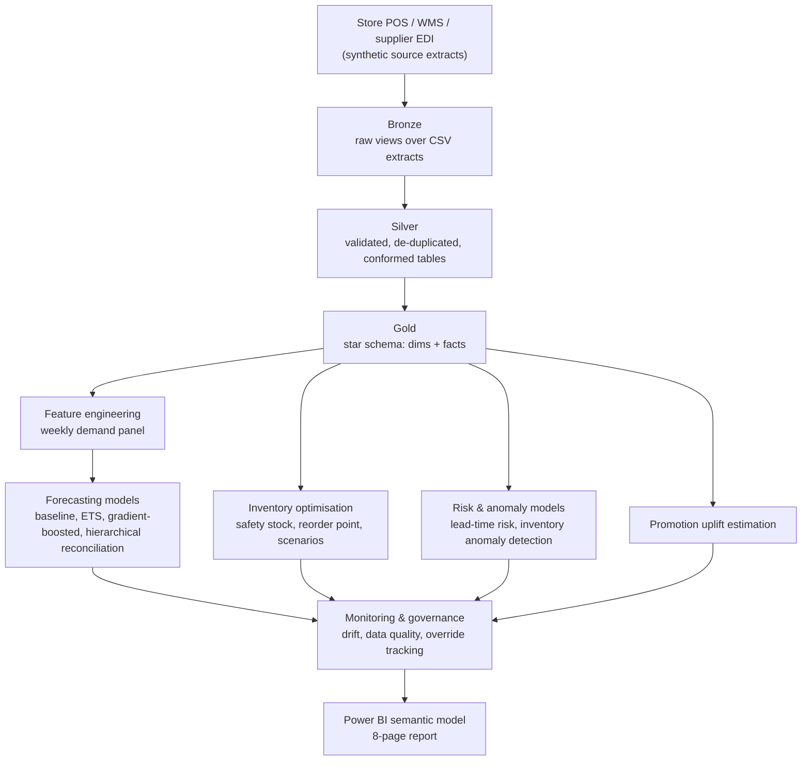

# Technical Architecture

The platform separates raw ingestion, validated conformed entities, decision-ready marts, model lifecycle assets and control evidence, in a standard medallion design. In Microsoft Fabric, bronze and silver map to Lakehouse Delta tables, gold maps to Warehouse or curated Lakehouse tables, orchestration maps to Data Factory pipelines or Fabric notebooks on a schedule, model training maps to Fabric notebooks with a model registry, and consumption maps to a Power BI semantic model over the gold layer. DuckDB provides an executable local substitute while preserving the same SQL layer boundaries - every bronze/silver/gold script in `sql/` is real SQL that runs unmodified against DuckDB today and against a Fabric Warehouse with only connection-string changes.

| Layer | Principal assets | Controls |
|---|---|---|
| Bronze | 17 raw source extracts (products, SKUs, stores, warehouses, suppliers, sales, inventory, purchase orders, lead times, promotions, prices, markdowns, holidays, weather, returns, stock-outs, replenishment decisions) | append-only extract, schema-on-read, no cleaning |
| Silver | Conformed, de-duplicated, referentially valid tables | uniqueness, referential integrity, null handling, outlier flagging (not silent deletion) |
| Gold | `dim_product`, `dim_store`, `dim_warehouse`, `dim_supplier`, `dim_date`, `fact_daily_sales`, `fact_inventory`, `fact_purchase_orders`, `fact_stockouts`, `fact_replenishment_decisions`, `supplier_performance` | certified metric definitions, ownership, freshness expectations |
| Features/ML | Weekly demand panel, safety-stock/reorder calculations, lead-time risk features, anomaly features | versioned feature logic, leakage-safe train/test split by time |
| Model registry | `demand_gbm`, `lead_time_risk` artifacts (joblib), evaluation metrics, monitoring thresholds | champion/challenger comparison, independent validation gate |
| Consumption | Power BI semantic model and 8-page report | row-level security by region/category, tooltip-level metric definitions |

## Orchestration

The reference orchestration is a single scheduled pipeline (`python -m supply_chain.pipeline`) that: generates or ingests source extracts, executes the bronze/silver/gold SQL in order, runs governance checks (blocking gold publication on any critical data-quality failure in a production deployment), trains and evaluates the forecast, inventory, risk and anomaly models, runs the monitoring controls, and exports the Power BI-ready datasets. In Fabric this becomes a Data Factory pipeline with one activity per stage, using the same script boundaries, so local development and production orchestration stay in lock-step.

## Sizing and scaling to production

The default `dev` scale (`supply_chain/config.py::DEV_SCALE`) generates roughly 16 products, 24 SKUs, 8 stores, 4 warehouses, 7 suppliers and 400 days of daily history - large enough to demonstrate every model and control with real, non-trivial statistics, small enough to regenerate and render in under two minutes on a laptop. `FULL_SCALE` in the same file models a mid-size regional retailer (60 products, 180 SKUs, 140 stores, 10 warehouses, 45 suppliers, 3 years of daily history) and is invoked with `python -m supply_chain.pipeline --scale full`. Moving from dev to full scale requires no code changes - every downstream model, SQL script and dashboard reads the same table shapes regardless of scale. Moving from DuckDB to Fabric requires only pointing the same SQL scripts at a Fabric Warehouse connection and scheduling the pipeline stages as Data Factory activities; no transformation logic changes.

## Dev mode note

CI and quick local iteration use `--scale dev --seed <n>` with a reduced history window; this keeps the full test suite and pipeline run under two minutes so pull requests get fast feedback. Production-representative validation should run at `--scale full` before any model promotion decision.
