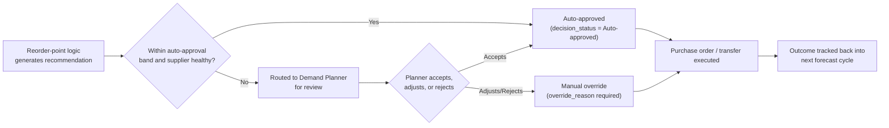

# Operating Model

**Daily.** Data Engineering confirms the pipeline run completed and reviews the data-quality pass rate. Inventory Analysts clear the prioritised stock-out risk and replenishment approval queues. Supply Chain Managers receive automated alerts for any supplier crossing the late-delivery threshold.

**Weekly.** Demand Planning Lead reviews the forecast accuracy trend (WMAPE) by category and the demand/feature drift report. Inventory Analysts review the inventory anomaly log and excess-stock report. Category Data Stewards review promotion uplift variance against plan for any promotions that closed that week.

**Monthly.** Data Science reviews model performance against the champion/baseline/challenger comparison and decides whether retraining is warranted. Supply Chain Manager reviews the supplier scorecard and follows up with any supplier in the "Watch" or "Critical" delivery-status band.

**Quarterly.** The Supply Chain Governance Forum (Demand Planning Lead, Supply Chain Manager, Data Science, Data Governance, Finance) reviews: realised value against the frozen baseline, the risk register, access recertification, master-data quality trend, and any pending model or scenario-assumption changes.

## Incident and exception handling

Data-quality or delivery incidents are triaged within four business hours of detection. A critical data-quality rule failure (see `governance/data_quality_rules.yml`) blocks gold-layer publication for the affected table until resolved or explicitly risk-accepted by the Data Governance owner. A critical forecast-accuracy or drift breach triggers a fallback to the baseline moving-average forecast for the affected category while the champion model is investigated and, if needed, retrained. Closure of any incident requires: root cause, affected scope (categories/stores/SKUs), corrective action, and sign-off from the accountable owner in the risk register.

## Model change process

Proposal → reproducible evidence (holdout metrics, feature list, training window) → independent review by Data Science → business owner sign-off → version increment in the model registry → staged rollout (shadow, then partial auto-approval, then full) → post-implementation review at 30 days. No model is promoted to full auto-approval without at least two weeks of shadow evaluation against the incumbent.

## Decision approval workflow

