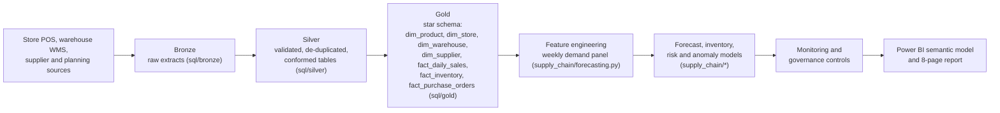

# Data Lineage

Every gold fact table retains its natural business key (`sku_id`, `store_id`/`location_id`, `date_key`, `po_id`, `decision_id`) so a report figure can always be traced back to the source row. Every model artifact records its training data window, feature list, hyperparameters, evaluation metrics and a version identifier in `artifacts/run_summary.json` and the model registry table (see [model_card.md](model_card.md)). Forecast outputs carry a `forecast_version` and `generated_at` timestamp; replenishment decisions carry `decision_status` and, where a planner intervened, `override_reason`, giving a complete decision audit trail from source data to executed order.

## Column-level lineage for key gold metrics

| Gold metric | Traced back through | Ultimate source |
|---|---|---|
| `fact_daily_sales.units_sold` | `silver.daily_sales` (de-duplicated, revenue-repaired) | `bronze.daily_sales` / store POS extract |
| `fact_inventory.days_of_supply` | `silver.inventory_snapshots` (negative on-hand clipped and flagged) | `bronze.inventory_snapshots` / warehouse and store inventory systems |
| `fact_purchase_orders.is_late` | `silver.purchase_orders` (orphaned SKU references removed) | `bronze.purchase_orders` / supplier EDI or manual PO log |
| `forecast_units` (advanced model) | weekly demand panel features (lags, rolling stats, promo/holiday/weather flags) | `fact_daily_sales`, `promotions`, `holidays`, `weather` |
| `reorder_point_units` | observed demand mean/std (56-day window) and observed lead-time mean/std by supplier-SKU | `fact_daily_sales`, `lead_times` (derived from `fact_purchase_orders`) |

## Reconciliation controls

Row counts and key totals are reconciled at every layer boundary: bronze row count must equal the source CSV row count; silver row count must be less than or equal to bronze (only documented de-duplication/orphan removal reduces it); gold fact totals (units, revenue) must match silver totals within rounding tolerance. `tests/test_pipeline.py` asserts these invariants on every pipeline run and CI build.
